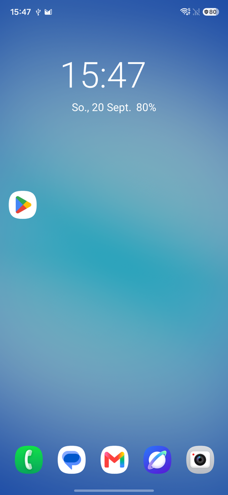
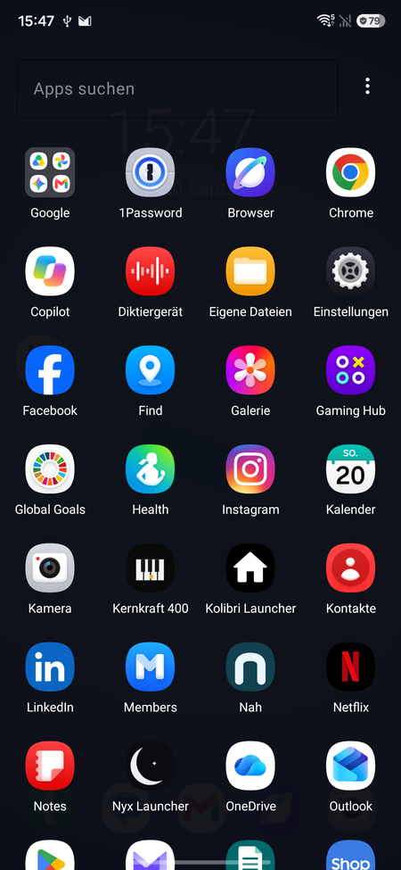

# Nyx Launcher

A minimalist Android home-screen launcher. Early days.

> **This repository publishes Nyx's releases only** — grab a signed build from
> the [**Releases**](../../releases) page. The source code is **not** hosted
> here; see [Source](#source) below.

## What it is

Nyx is a stripped-down home screen: a clean home layout with folders and a
dock, plus a swipe-up app drawer with instant search. No widgets, no
"discover" tabs, no clutter.

It shares its architecture and conventions with its sister project
[Kolibri](https://github.com/reygnn/Kolibri-Launcher) — a Clean-Architecture
module split, Hilt for DI, Coroutines/Flow for async, and a JVM-first test
suite.

## Screenshots

<table>
  <tr>
    <td align="center">
       
      Home — clock, dock and icon grid
    </td>
    <td align="center">
       
      App drawer — instant search and folders
    </td>
  </tr>
</table>

First run, fresh install (Android 16).

## Source

Nyx's source lives in the
**[Kolibri-Launcher monorepo](https://github.com/reygnn/Kolibri-Launcher)**
under [`nyx/`](https://github.com/reygnn/Kolibri-Launcher/tree/main/nyx),
alongside the shared `:core` / `:common-ui` / `:common-data` modules it builds
on. Build instructions, module layout and specs are there.

## License

GPL-3.0-or-later. Full license text and source: see the monorepo.
